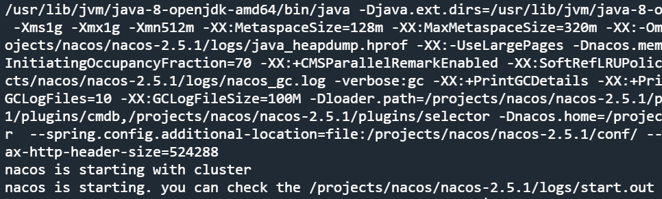
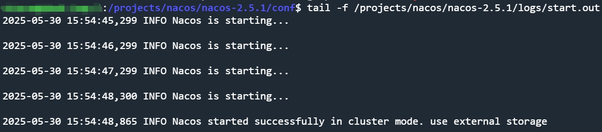
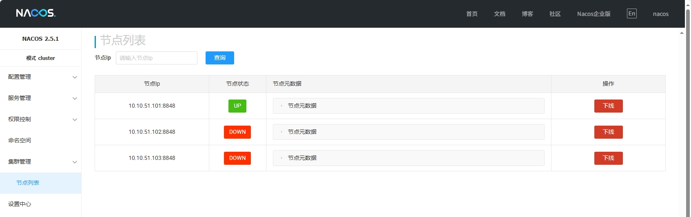

# Linux部署Nacos(集群)

**环境**：
- Ubuntu24.04.2 LTS

**使用端口**：
- `8848`

---

## (1).下载Nacos
从[官网](https://nacos.io/download/nacos-server/)或[GitHub](https://github.com/alibaba/nacos)下载Nacos

## (2).安装java环境
```bash
sudo apt install openjdk-8-jdk
java -version
```

## (3).上传并编辑配置文件
将源码解压到目录

如果没有上传权限,就给这个目录权限
```bash
sudo chmod 777 /opt
```
或者放到本地Nginx下,用`wget`指令下载到此目录

解压zip文件
```bash
sudo unzip nacos-server-2.5.1.zip
sudo mv ./nacos /projects/nacos/nacos-2.5.1
```

修改启动配置(可选)
```bash
sudo vi /projects/nacos/nacos-2.5.1/bin/startup.sh
```
```vim
# 将内存使用调小一些
JAVA_OPT="${JAVA_OPT} -server ${CUSTOM_NACOS_MEMORY:- -Xms2g -Xmx2g -Xmn1g -XX:MetaspaceSize=128m -XX:MaxMetaspaceSize=320m}"
JAVA_OPT="${JAVA_OPT} -server ${CUSTOM_NACOS_MEMORY:- -Xms1g -Xmx1g -Xmn512m -XX:MetaspaceSize=128m -XX:MaxMetaspaceSize=320m}"
```

修改集群配置(改成自己的ip)
```bash
sudo vi /projects/nacos/nacos-2.5.1/conf/cluster.conf
```
```vim
10.10.51.101:8848
10.10.51.102:8848
10.10.51.103:8848
```

修改Nacos配置
```bash
sudo vi /projects/nacos/nacos-2.5.1/conf/application.properties
```
```vim
# 指定Nacos实例对外暴露的ip(可选,如果不配置,则需要确保/etc/hosts有配置本主机对应的ip)
nacos.inetutils.ip-address=10.10.51.101
# 使用MySQL作为数据源(集群模式不能像单机一样用内置数据源)
spring.sql.init.platform=mysql
# 数据库数据源数量
db.num=1
# 数据库连接配置,根据实际情况填写
db.url.0=jdbc:mysql://127.0.0.1:3306/nacos?characterEncoding=utf8&connectTimeout=1000&socketTimeout=3000&autoReconnect=true&useUnicode=true&useSSL=false&serverTimezone=Asia/Shanghai
db.user.0=nacos
db.password.0=nacos
# 开启Nacos控制台(可选)
nacos.console.ui.enabled=true
# 开启Nacos控制台的登录验证(可选,需要配置账号密码请自行查找文档)
nacos.core.auth.enabled=true
nacos.core.auth.server.identity.key=admin
nacos.core.auth.server.identity.value=admin
# 配置JWT密钥(可以使用指令随机生成`openssl rand -base64 32`)
nacos.core.auth.plugin.nacos.token.secret.key=0ai0NRBRiBeFmsRmt1PTT6/o4/M0mZGB1DjwtD0kI3c=
```

## (4).运行Nacos
```bash
sudo /projects/nacos/nacos-2.5.1/bin/startup.sh -p 8848 -m cluster
```


查看日志
```bash
tail -f /projects/nacos/nacos-2.5.1/logs/start.out
```
出现以下提示,则成功运行


## (5).配置Nacos的systemd服务
查看本机java环境
```bash
readlink -f $(which java) | sed "s:bin/java::"
```
```bash
sudo vi /etc/systemd/system/nacos.service
```
```vim
[Unit]
Description=Nacos Server
After=network.target

[Service]
Type=forking
User=nacos
Group=nacos
ExecStart=/projects/nacos/nacos-2.5.1/bin/startup.sh -p 8848 -m cluster
ExecStop=/projects/nacos/nacos-2.5.1/bin/shutdown.sh
Restart=always
RestartSec=10
LimitNOFILE=65536
Environment="JAVA_HOME=/usr/lib/jvm/java-8-openjdk-amd64/jre/"

[Install]
WantedBy=multi-user.target
```

刷新systemd配置文件&设置开机自启(start前记得先kill掉原有进程)
```bash
sudo systemctl daemon-reload
sudo systemctl enable nacos
sudo systemctl start nacos
sudo systemctl status nacos
```

查看日志,发现权限不足
```bash
journalctl -u nacos
sudo chmod -R 755 /projects/nacos/nacos-2.5.1/
sudo chown -R nacos:nacos /projects/nacos/nacos-2.5.1/
```

## (6).开放端口
```bash
sudo ufw allow 8848/tcp
sudo ufw reload
sudo ufw status numbered
```

## (7).登录面板
浏览器输入面板地址`http://10.10.51.101:8848/nacos/`

第一次进入设置一下密码,然后就能正常使用面板了

