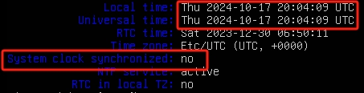
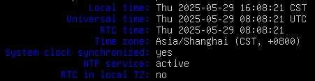

# Ubuntu同步网络时间

**环境**：
- Ubuntu24.04.2 LTS

---

## (1).查看当前时间
```bash
timedatectl status
```


## (2).更换NTP源
```bash
sudo vi /etc/systemd/timesyncd.conf
```
```vim
[Time]
NTP=ntp.aliyun.com
FallbackNTP=ntp.ubuntu.com
```

## (3).启用NTP同步
```bash
sudo timedatectl set-ntp true
```

## (4).重启服务
```bash
sudo timedatectl set-timezone Asia/Shanghai
```

## (5).修改时区
```bash
sudo systemctl restart systemd-timesyncd
timedatectl status
```

