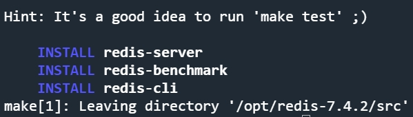
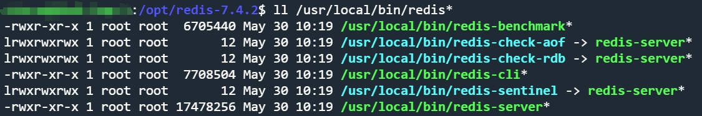
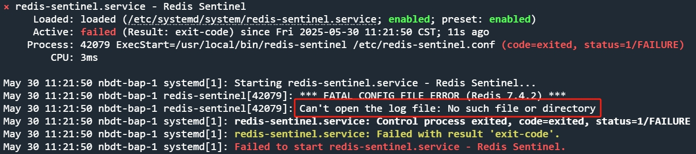
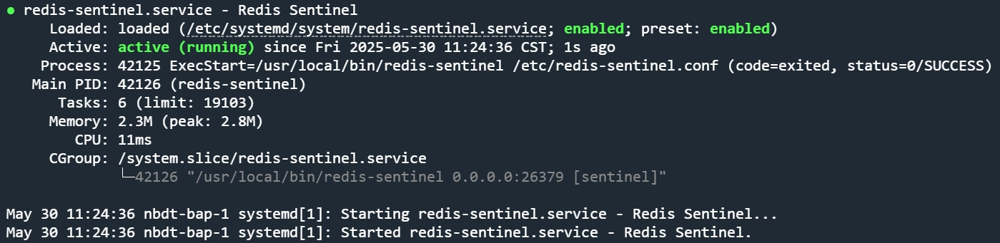
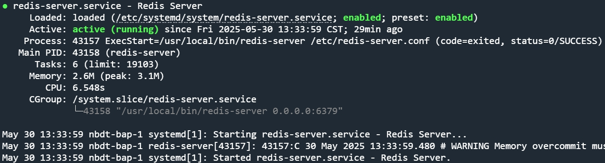

# Ubuntu编译部署Redis(主从+哨兵)

**环境**：
- Ubuntu24.04.2 LTS

**使用端口**：
- `26379`
- `6379`

---

## (1).下载源代码
从官网或[GitHub](https://github.com/redis/redis/releases)下载源代码

## (2).安装编译环境
```bash
sudo apt install gcc
sudo apt install make
sudo apt install unzip
```

## (3).编译安装源码
将源码解压到目录

如果没有上传权限,就给这个目录权限
```bash
sudo chmod 777 /opt
```
或者放到本地Nginx下,用`wget`指令下载到此目录

解压zip文件
```bash
sudo unzip redis-7.4.2.zip
```

编译&安装
```bash
cd ./redis-7.4.2
sudo make
sudo make install
```

出现以下提示则安装完成



可以clean一下
```bash
sudo make clean
```

可执行文件默认位于/usr/local/bin/下




## (4).编辑配置文件(密码部分需要自行修改)
redis哨兵配置文件
```bash
sudo vi /etc/redis-sentinel.conf
```
```vim
# 基本配置
port 26379
bind 0.0.0.0
protected-mode no
daemonize yes
logfile /var/log/redis/redis-sentinel.log

# 监控Master,redis-master是自定义名称后面是redis-master的ip,至少需要2个Sentinel同意主节点宕机才执行故障转移
sentinel monitor redis-master 10.10.51.101 6379 2
# Sentinel 访问 Redis 的密码
sentinel auth-pass redis-master g7G6dM3o9zO
# 如果在 5000 毫秒内没有收到主节点的响应，认为主节点宕机
sentinel down-after-milliseconds redis-master 5000
# 允许同时同步新 Master 的 Slave 数量
sentinel parallel-syncs redis-master 1
# 故障转移超时时间
sentinel failover-timeout redis-master 15000
```

将`redis.conf`复制到`/etc/`下,然后修改对应配置
```bash
sudo cp /opt/redis-7.4.2/redis.conf /etc/redis.conf
sudo vi /etc/redis.conf
```

master节点:
```vim
# 监听地址
bind 0.0.0.0    # 危险操作! 确认没问题再修改
# 以守护进程(后台进程)启动
daemonize yes
# 主机密码
masterauth g7G6dM3o9zO
# 本机密码
requirepass g7G6dM3o9zO
```

slave节点:
```vim
# 监听地址
bind 0.0.0.0    # 危险操作! 确认没问题再修改
# 以守护进程(后台进程)启动(systemd)
daemonize yes
# 主机地址(需要去这个地址复制数据)
replicaof 10.10.51.101 6379
# 主机密码
masterauth g7G6dM3o9zO
# 本机密码
requirepass g7G6dM3o9zO
```

## (5).配置哨兵systemd服务
```bash
sudo vi /etc/systemd/system/redis-sentinel.service
```
```vim
[Unit]
Description=Redis Sentinel
After=network.target

[Service]
Type=forking
ExecStart=/usr/local/bin/redis-sentinel /etc/redis-sentinel.conf
ExecStop=/usr/local/bin/redis-cli -p 26379 shutdown
ExecReload=/usr/local/bin/redis-cli -p 26379 shutdown && /usr/local/bin/redis-sentinel /etc/redis-sentinel.conf
PrivateTmp=true

[Install]
WantedBy=multi-user.target
```

刷新systemd配置文件&设置开机自启
```bash
sudo systemctl daemon-reload
sudo systemctl enable redis-sentinel
sudo systemctl start redis-sentinel
sudo systemctl status redis-sentinel
```

发现启动异常,找不到日志文件路径:



上面配置的日志文件路径是`/var/log/redis/redis-sentinel.log`,所以创建一下就可以了
```bash
sudo mkdir -p /var/log/redis
sudo systemctl restart redis-sentinel
sudo systemctl status redis-sentinel
```

启动成功


## (6).配置Redis的systemd服务
```bash
sudo vi /etc/systemd/system/redis-server.service
```
```vim
[Unit]
Description=Redis Server
After=network.target

[Service]
Type=forking
Environment="REDISCLI_AUTH=g7G6dM3o9zO"
ExecStart=/usr/local/bin/redis-server /etc/redis-server.conf
ExecStop=/usr/local/bin/redis-cli -p 6379 shutdown
ExecReload=/usr/local/bin/redis-cli -p 6379 shutdown && /usr/local/bin/redis-server /etc/redis-server.conf
PrivateTmp=true

[Install]
WantedBy=multi-user.target
```

刷新systemd配置文件&设置开机自启
```bash
sudo systemctl daemon-reload
sudo systemctl enable redis-server
sudo systemctl start redis-server
sudo systemctl status redis-server
```

启动成功


## (7).开放端口
确保防火墙已经安装并启动(启动之前记得要开放SSH端口,不然断开以后连不上)
```bash
sudo ufw enable
```

```bash
sudo ufw allow 6379/tcp
sudo ufw allow 26379/tcp
sudo ufw reload
sudo ufw status numbered
```

## (8).提示
以上service配置没有显式指定日志的输出位置,因此日志的归属由Systemd默认行为决定;默认情况下,Systemd管理的服务日志输出都会进入journald日志系统,包括ExecStart/ExecStop/ExecReload的输出和后台进程标准输出/错误输出(stdout/stderr)

可以使用以下指令查看运行日志:
```bash
journalctl -u redis-sentinel
journalctl -u redis-server
```

可以使用以下指令查看节点情况:
```bash
redis-cli -a g7G6dM3o9zO INFO replication
```
