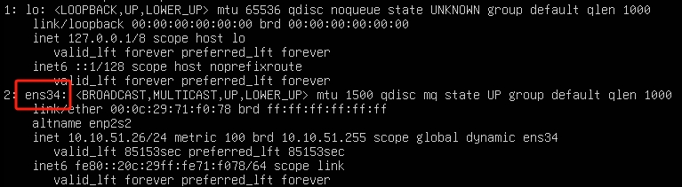
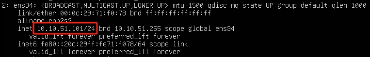

# Ubuntu配置固定ip

**环境**：
- Ubuntu24.04.2 LTS

---

## (1).查看网卡配置
```bash
ip add
```


## (2).编辑配置文件
```bash
cd /etc/netplan
sudo vi ./50-cloud-init.yaml
```
```vim
network:
  renderer: networkd
  version: 2
  ethernets:
    ens34:                  # 网卡名称
      dhcp4: no
      addresses:
        - 10.10.51.23/24    # ip/子网掩码
      routes:
        - to: default
          via: 10.10.51.1   # 网关
      nameservers:
        addresses:          # DNS
          - 114.114.114.114
          - 8.8.8.8
```

## (3).保存编辑
```bash
sudo netplan apply
sudo systemctl restart systemd-networkd
ip addr
```
